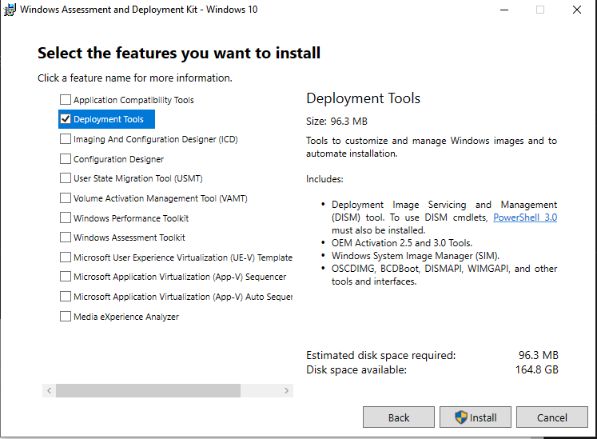

# vagrant-box-amzn2

Builds a vagrant box with amazon linux 2.

This only support virtualbox and uses vboxmanage to convert the vdi to ovf before packer can work with it.

This has been tested on the following stack:

* windows (10)
* git bash (2.41.0)
* vboxmanage (6.1.44r156814)
* packer (1.7.10)
* vagrant (1.7.10)
* windows adk development kit (Deployment tools)

It should work with later versions but no promises.

Based on <https://docs.aws.amazon.com/AWSEC2/latest/UserGuide/amazon-linux-2-virtual-machine.html>

## seed.iso

Packer can build the seed iso for us. On windows this needs the windows adk development kit (Deployment tools).

<https://developer.hashicorp.com/packer/integrations/hashicorp/virtualbox/latest/components/builder/ovf#cd-configuration>

You can install this from [here](https://learn.microsoft.com/en-us/windows-hardware/get-started/adk-install). Tested with
[this](https://go.microsoft.com/fwlink/?linkid=2086042)

You only need the development tools so uncheck everything else. Make sure oscdimg is on the path.



On windows 10 this defaults to "C:\Program Files (x86)\Windows Kits\10\Assessment and Deployment Kit\Deployment Tools\amd64\Oscdimg"

```bash
export PATH=$PATH:/c/Program\ Files\ \(x86\)/Windows\ Kits/10/Assessment\ and\ Deployment\ Kit/Deployment\ Tools/amd64/Oscdimg/
```

## Build OVF from VDI

packer cannot (I dont think) go straight from VDI to vagrant box. There are virtualbox builders for iso and ovf. We can
create a ovf from a vdi using vboxmanage.

```bash
# clone the repo locally
# ensure you have virtualbox and packer on the path
cd vagrant-box-amzn2
./vdi2ovf.sh
```

This will download the vid into the working folder and create a ovf in the output-ovf folder. Both these locations are in
the .gitignore.

If you want to you can change the vdi in [vdi2ovf.sh](./vdi2ovf.sh#L8)

## Build vagrant box from OVF

Next you can run packer to create the box. There is a wrapper script called ./build.sh. Note: this assumes you installed
packer as packer.io.exe (just copy packer.exe). This is common practice on linux where there is another tool called
packer sometimes present. This makes the script more transferable back and forth to linux.

```bash
./build.sh
```

This will build the box and create a .box file in the repo folder. If will also import the results to the local vagrant
which you can see with `vagrant box list`

## Testing the box

There is a basic Vagrantfile which uses the box.

Run

```bash
vagrant up
```

## Important Info

The ec2-users password is set to packer so you should change this as part of your vagrant up provisioners to secure the
environment.
